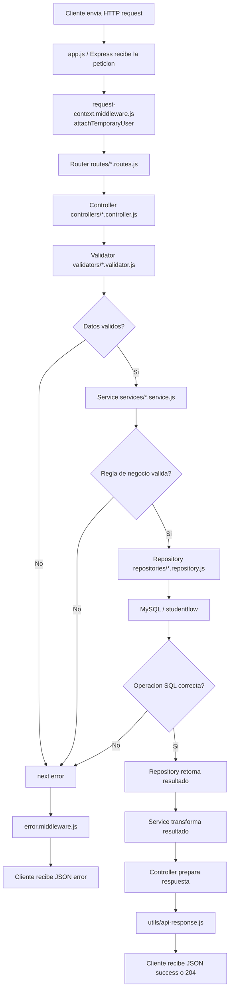

# Diagrama de flujo de una petición al backend

```mermaid
flowchart TD
    A[Cliente envia HTTP request] --> B[app.js / Express recibe la peticion]
    B --> C[request-context.middleware.js<br/>attachTemporaryUser]
    C --> D[Router routes/*.routes.js]
    D --> E[Controller controllers/*.controller.js]
    E --> F[Validator validators/*.validator.js]

    F --> G{Datos validos?}
    G -- No --> H[next error]
    H --> I[error.middleware.js]
    I --> J[Cliente recibe JSON error]

    G -- Si --> K[Service services/*.service.js]
    K --> L{Regla de negocio valida?}
    L -- No --> H
    L -- Si --> M[Repository repositories/*.repository.js]
    M --> N[MySQL / studentflow]
    N --> O{Operacion SQL correcta?}
    O -- No --> H
    O -- Si --> P[Repository retorna resultado]
    P --> Q[Service transforma resultado]
    Q --> R[Controller prepara respuesta]
    R --> S[utils/api-response.js]
    S --> T[Cliente recibe JSON success o 204]
```
